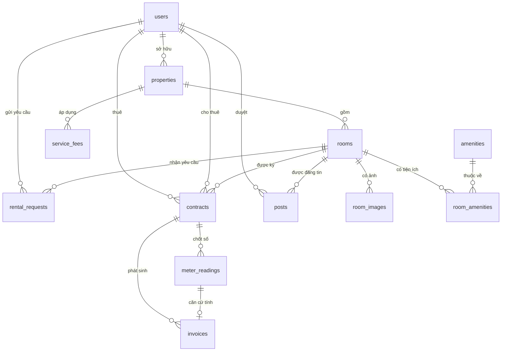
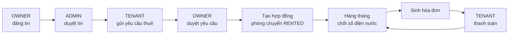

# DUCHOME — Sơ đồ quan hệ thực thể (ERD)

> Sinh từ `backend/prisma/schema.prisma`, khớp với migration `20260920154904_init`.
> Database: `duchome` — MySQL 8.0 — charset `utf8mb4_unicode_ci`.

Hệ thống gồm **12 bảng nghiệp vụ** (chưa kể bảng `_prisma_migrations` do Prisma tự quản lý).

---

## 1. Sơ đồ tổng quát

## 2. Luồng nghiệp vụ xuyên suốt

---

## 3. Chi tiết từng bảng

### 3.1. `users` — Người dùng

Dùng chung cho cả ba actor, phân biệt bằng cột `role`.

| Cột | Kiểu | Ràng buộc | Ý nghĩa |
|---|---|---|---|
| id | INT | PK, AUTO_INCREMENT | |
| email | VARCHAR(120) | UNIQUE, NOT NULL | Dùng để đăng nhập |
| phone | VARCHAR(20) | UNIQUE, NULL | |
| password | VARCHAR(255) | NOT NULL | Băm bằng bcrypt, 10 vòng |
| fullName | VARCHAR(120) | NOT NULL | |
| avatar | VARCHAR(255) | NULL | Đường dẫn ảnh đại diện |
| role | ENUM | ADMIN / OWNER / TENANT | Mặc định TENANT |
| status | ENUM | ACTIVE / LOCKED | ADMIN dùng để khóa tài khoản |
| createdAt, updatedAt | DATETIME(3) | | |

Chỉ mục: `role`.

### 3.2. `properties` — Nhà trọ / tòa nhà

Một OWNER có thể sở hữu nhiều nhà trọ. Đơn giá điện nước đặt ở cấp nhà trọ vì thực tế cả dãy dùng chung một mức giá.

| Cột | Kiểu | Ràng buộc | Ý nghĩa |
|---|---|---|---|
| id | INT | PK | |
| ownerId | INT | FK → users.id | Chủ trọ |
| name | VARCHAR(150) | NOT NULL | VD: "Nhà trọ Đức Home 1" |
| address | VARCHAR(255) | NOT NULL | Số nhà, tên đường |
| province, district, ward | VARCHAR(100) | NOT NULL | Tỉnh / quận / phường |
| description | TEXT | NULL | |
| electricPrice | INT | Mặc định 3500 | VND mỗi kWh |
| waterPrice | INT | Mặc định 15000 | VND mỗi m³ |

Chỉ mục: `ownerId`, và `(province, district)` phục vụ tìm kiếm theo khu vực.

### 3.3. `rooms` — Phòng

| Cột | Kiểu | Ràng buộc | Ý nghĩa |
|---|---|---|---|
| id | INT | PK | |
| propertyId | INT | FK → properties.id, ON DELETE CASCADE | |
| code | VARCHAR(50) | UNIQUE cùng propertyId | Mã phòng, VD "P101" |
| area | FLOAT | NOT NULL | Diện tích m² |
| price | INT | NOT NULL | Giá thuê mỗi tháng (VND) |
| deposit | INT | Mặc định 0 | Tiền cọc |
| maxOccupants | INT | Mặc định 2 | Số người tối đa |
| status | ENUM | AVAILABLE / RENTED / HIDDEN | |
| description | TEXT | NULL | |

Ràng buộc `UNIQUE(propertyId, code)` bảo đảm không trùng mã phòng trong cùng một nhà trọ, nhưng hai nhà trọ khác nhau vẫn được đặt trùng tên "P101".

Chỉ mục: `status`, `price` phục vụ lọc và sắp xếp.

### 3.4. `room_images` — Ảnh phòng

| Cột | Kiểu | Ràng buộc |
|---|---|---|
| id | INT | PK |
| roomId | INT | FK → rooms.id, ON DELETE CASCADE |
| url | VARCHAR(255) | Đường dẫn tương đối, VD `/uploads/abc.jpg` |
| sortOrder | INT | Thứ tự hiển thị, ảnh đầu tiên làm ảnh bìa |

### 3.5. `amenities` — Tiện ích

Danh mục dùng chung toàn hệ thống (wifi, máy lạnh, gác lửng…), do ADMIN quản lý.

| Cột | Kiểu | Ràng buộc |
|---|---|---|
| id | INT | PK |
| name | VARCHAR(80) | UNIQUE |
| icon | VARCHAR(80) | Tên icon hiển thị ở mobile |

### 3.6. `room_amenities` — Tiện ích của phòng

Bảng trung gian giải quyết quan hệ nhiều–nhiều giữa `rooms` và `amenities`.

| Cột | Kiểu | Ràng buộc |
|---|---|---|
| roomId | INT | PK kết hợp, FK → rooms.id |
| amenityId | INT | PK kết hợp, FK → amenities.id |

Khóa chính kết hợp `(roomId, amenityId)` tự nó ngăn việc gán trùng một tiện ích hai lần cho cùng một phòng.

### 3.7. `service_fees` — Phí dịch vụ

Các khoản cố định hằng tháng ngoài tiền phòng, điện, nước: rác, wifi, gửi xe…

| Cột | Kiểu | Ràng buộc |
|---|---|---|
| id | INT | PK |
| propertyId | INT | FK → properties.id, ON DELETE CASCADE |
| name | VARCHAR(100) | VD "Phí rác" |
| price | INT | VND |
| unit | VARCHAR(30) | tháng / người / xe |

### 3.8. `posts` — Tin đăng

Tách riêng khỏi `rooms` vì hai lý do: ADMIN có hai chức năng quản lý độc lập, và một phòng có thể được đăng lại nhiều lần theo thời gian.

| Cột | Kiểu | Ràng buộc | Ý nghĩa |
|---|---|---|---|
| id | INT | PK | |
| roomId | INT | FK → rooms.id, ON DELETE CASCADE | |
| title | VARCHAR(200) | NOT NULL | |
| description | TEXT | NOT NULL | |
| status | ENUM | PENDING / APPROVED / REJECTED / HIDDEN | Mặc định PENDING |
| reviewedById | INT | FK → users.id, NULL | ADMIN đã duyệt |
| reviewedAt | DATETIME | NULL | |
| rejectReason | VARCHAR(255) | NULL | Lý do từ chối |
| viewCount | INT | Mặc định 0 | Lượt xem |
| publishedAt | DATETIME | NULL | Thời điểm được duyệt |

Chỉ mục: `roomId`, `status`.

### 3.9. `rental_requests` — Yêu cầu thuê

| Cột | Kiểu | Ràng buộc | Ý nghĩa |
|---|---|---|---|
| id | INT | PK | |
| roomId | INT | FK → rooms.id | |
| tenantId | INT | FK → users.id | Người gửi |
| note | VARCHAR(500) | NULL | Lời nhắn của khách |
| expectedMoveIn | DATETIME | NULL | Ngày dự kiến dọn vào |
| status | ENUM | PENDING / APPROVED / REJECTED / CANCELLED | CANCELLED là khách tự hủy |
| ownerReply | VARCHAR(500) | NULL | Phản hồi của chủ trọ |
| respondedAt | DATETIME | NULL | |

Chỉ mục: `roomId`, `tenantId`, `status`.

### 3.10. `contracts` — Hợp đồng

| Cột | Kiểu | Ràng buộc | Ý nghĩa |
|---|---|---|---|
| id | INT | PK | |
| code | VARCHAR(30) | UNIQUE | Mã hợp đồng hiển thị cho người dùng |
| roomId | INT | FK → rooms.id | |
| tenantId | INT | FK → users.id | Bên thuê |
| ownerId | INT | FK → users.id | Bên cho thuê |
| startDate, endDate | DATETIME | NOT NULL | |
| price | INT | NOT NULL | Giá chốt trong hợp đồng, độc lập với `rooms.price` hiện tại |
| deposit | INT | Mặc định 0 | |
| status | ENUM | ACTIVE / ENDED / TERMINATED | |
| terminatedAt | DATETIME | NULL | Ngày chấm dứt trước hạn |

`price` được sao chép lại thay vì tham chiếu `rooms.price`, để chủ trọ đổi giá niêm yết về sau không làm sai lệch hợp đồng đã ký.

Chỉ mục: `roomId`, `tenantId`, `ownerId`, `status`.

### 3.11. `meter_readings` — Chốt số điện nước

| Cột | Kiểu | Ràng buộc | Ý nghĩa |
|---|---|---|---|
| id | INT | PK | |
| contractId | INT | FK → contracts.id, ON DELETE CASCADE | |
| month, year | INT | UNIQUE cùng contractId | Kỳ chốt số |
| electricOld, electricNew | INT | NOT NULL | Chỉ số điện đầu kỳ và cuối kỳ |
| waterOld, waterNew | INT | NOT NULL | Chỉ số nước đầu kỳ và cuối kỳ |
| note | VARCHAR(255) | NULL | |

Ràng buộc `UNIQUE(contractId, year, month)` chặn việc chốt số hai lần cho cùng một tháng.

### 3.12. `invoices` — Hóa đơn

| Cột | Kiểu | Ràng buộc | Ý nghĩa |
|---|---|---|---|
| id | INT | PK | |
| code | VARCHAR(30) | UNIQUE | Mã hóa đơn |
| contractId | INT | FK → contracts.id, ON DELETE CASCADE | |
| meterReadingId | INT | UNIQUE, FK, NULL | Bản chốt số làm căn cứ |
| month, year | INT | UNIQUE cùng contractId | Kỳ hóa đơn |
| rentAmount | INT | | Tiền phòng |
| electricUnit | INT | | Đơn giá điện **tại thời điểm lập** |
| electricUsage | INT | | Số kWh tiêu thụ |
| electricAmount | INT | | electricUnit × electricUsage |
| waterUnit, waterUsage, waterAmount | INT | | Tương tự cho nước |
| serviceAmount | INT | Mặc định 0 | Tổng phí dịch vụ |
| totalAmount | INT | | Tổng cộng phải trả |
| status | ENUM | UNPAID / PAID / OVERDUE | |
| dueDate | DATETIME | NOT NULL | Hạn thanh toán |
| paidAt | DATETIME | NULL | |

Hóa đơn lưu lại **đơn giá tại thời điểm lập** chứ không tham chiếu sang `properties`. Nhờ vậy, khi chủ trọ tăng giá điện, các hóa đơn cũ vẫn giữ nguyên con số đã phát hành.

Chỉ mục: `status`.

---

## 4. Quy ước thiết kế

**Tiền tệ lưu kiểu `INT`, đơn vị VND.** Đồng Việt Nam không có phần lẻ nên không cần `DECIMAL`. Ngoài ra `DECIMAL` của Prisma khi chuyển sang JSON sẽ thành chuỗi, gây vướng khi tính toán ở React Native. Giá trị lớn nhất của `INT` là 2.147.483.647 đồng, thừa sức cho mọi hóa đơn thuê trọ.

**Xóa dây chuyền (`ON DELETE CASCADE`)** áp dụng cho các bảng phụ thuộc hoàn toàn vào bảng cha: xóa phòng thì ảnh và tiện ích của phòng đi theo. Riêng `contracts` **không** cascade khi xóa `rooms` — hợp đồng là chứng từ pháp lý, phải giữ lại.

**Dữ liệu chốt sổ được sao chép, không tham chiếu.** Áp dụng ở `contracts.price` và các cột `*Unit` của `invoices`, nhằm bảo toàn tính lịch sử của chứng từ.

---

## 5. Cách xuất ERD từ MySQL Workbench

Sơ đồ Mermaid ở trên dùng để đọc nhanh trong mã nguồn. Để có ảnh EER đưa vào quyển báo cáo, làm theo các bước sau:

1. Mở MySQL Workbench, kết nối tới `localhost:3306`.
2. Menu **Database ▸ Reverse Engineer…** (phím tắt `Ctrl + R`).
3. Chọn connection → **Next** → **Next** (chờ kết nối).
4. Ở bước **Select Schemas**, tick vào `duchome` → **Next**.
5. **Next** tiếp cho tới bước **Select Objects**, giữ nguyên mặc định (chọn tất cả bảng) → **Execute**.
6. **Next** → **Close**. Sơ đồ EER hiện ra.
7. Sắp xếp lại các bảng cho dễ nhìn: kéo `users` lên trên cùng, nhóm `properties`–`rooms`–`room_images` bên trái, nhóm `contracts`–`meter_readings`–`invoices` bên phải.
8. Xuất ảnh: **File ▸ Export ▸ Export as PNG…**, lưu vào `docs/erd-workbench.png`.

**Lưu ý khi làm bước 5:** Workbench sẽ hiển thị cả bảng `_prisma_migrations`. Bảng này do công cụ tự tạo để theo dõi lịch sử migration, không thuộc nghiệp vụ — nên bỏ tick để sơ đồ trong báo cáo chỉ còn đúng 12 bảng.
